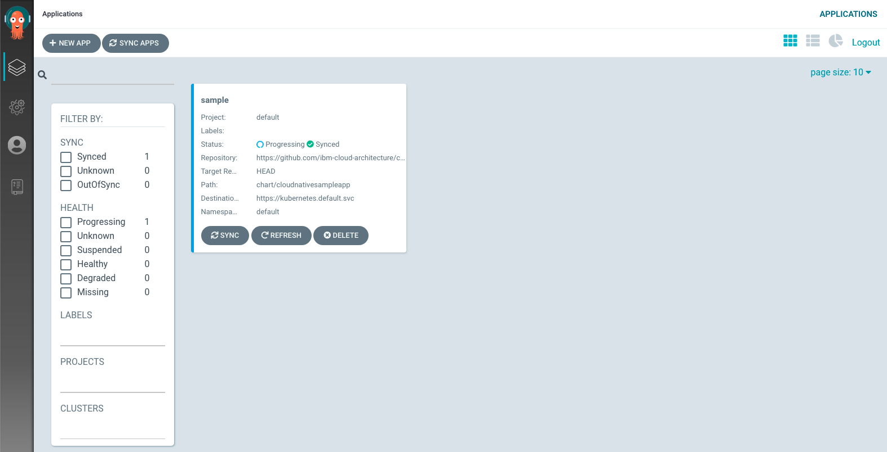
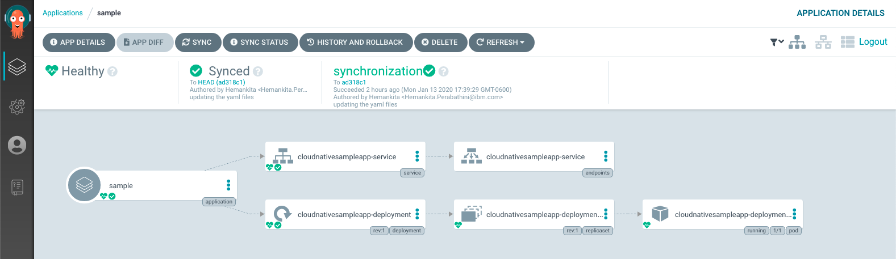

# openshift-gitops-101

## 1. Install operator

1. Create a project named `argocd`

2. With the `argocd` project selected, go to the operator hub and search for `argo`

3. Select the Argo CD operator


*Note: use the ArgoCD provided operator*

4. Select `Continue` and `Install`

5. On the `Create Operator Subscription` screen, select the installation namespace to be `argocd` (your newly created project)


## 2. Check installation

1. Normally it takes a minute or two until the installation is complete. A good indication is when the pods in the `argocd` namespace are stable (1/1)

2. To enable full cluster admin access on OpenShift, run the following command. This step is generally optional but recommended for this exercise.

    ```bash
    oc adm policy add-cluster-role-to-user cluster-admin -z argocd-application-controller -n argocd
    ```

## 3. Enable the ArgoCD UI

1. Take the yaml located [here](./1_argo-cd.yaml) and apply it inside the `argocd` namespace

    ```bash
    # selecting project
    oc project argocd

    # applying ArgoCD resource
    oc apply -f ./0_argo-cd.yaml
    ```

2. There will be several Argo CD resources created that should be familiar to anyone who has deployed Argo CD.

    ```bash
    oc get cm,secret,deploy
    ```

3. When everything is installed, you can fetch argocd's URLs:

    ```bash
    oc get routes
    ``` 

4. Open the route URL in a browser

5. One of the cluster `Secrets` contains the admin password for authenticating with Argo CD, as well as the Grafana dashboard, if enabled. Fetch the admin password from the cluster Secret.

    ```bash
    kubectl get secret example-argocd-cluster -o jsonpath='{.data.admin\.password}' | base64 -d
    ```

6. You can log into the web UI with the username `admin` and the password extracted from the step above


7. You should have access to the main dashboard

## 4. Create you application

1. Click on `NEW APP`.
2. Add the below details:
   - Application Name: `sample`
   - Project: `default`
   - SYNC POLICY: `Manual`
   - REPO URL: `https://github.com/ibm-garage-cph/openshift-gitops-101`
   - Revision: `HEAD`
   - Path: `openshift`


3. Cluster: Select the default one `https://kubernetes.default.svc` to deploy in-cluster
4. Namespace: `dev-<your initials>` (e.g. dev-mn)
5. Click Create to finish


6. You will now see the available apps.


7. Initially, the app will be out of sync. It is yet to be deployed. You need to sync it for deploying. To sync the application, click `SYNC` and then `SYNCHRONIZE`.


8. Wait untill the app is deployed.



9. Once the app is deployed, click on it to see the details.





## 5. Verifying the deployment

- Access the app to verify if it is correctly deployed.
- List the cloudnativesampleapp-service route
- 
    ```bash
    oc get route
    ```
    It should have an IP under `EXTERNAL-IP` column
    ```
    NAME                 HOST/PORT                                     PATH   SERVICES                       PORT   TERMINATION   WILDCARD
    cloudnative-sample   cloudnative-sample-default.apps-crc.testing          cloudnativesampleapp-service   9080                 None
    ```
- Set an environment variable `APP_URL` using the `EXTERNAL-IP`

    ```bash
    export APP_URL="http://$(oc get route cloudnative-sample -o jsonpath='{.status.ingress[0].host}')"
    echo ARGOCD_SERVER=$APP_URL
    ```

- Access the url using `curl`
  
    ```bash
    curl "$APP_URL/greeting?name=Carlos"
    ```

    ```json
    {"id":2,"content":"Welcome to Cloudnative bootcamp !!! Hello, Carlos :)"}
    ```


## 6. Using the ArgoCD CLI

- Login using the cli.
- Login as the `admin` user.
- The initial password is autogenerated. It's the same password as in step 3.5
- Now login as follows.
    ```bash
    argocd login $ARGOCD_SERVER
    ```
    
    ```
    WARNING: server certificate had error: x509: cannot validate certificate for 10.97.240.99 because it doesn't contain 
    any IP SANs. Proceed insecurely (y/n)? y
    Username: admin
    Password: 
    'admin' logged in successfully
    Context '10.97.240.99' updated
    ```
- List the applications
    ```bash
    argocd app list
    ```
    ```
    NAME    CLUSTER                         NAMESPACE  PROJECT  STATUS  HEALTH   SYNCPOLICY  CONDITIONS  REPO                                                                     PATH   TARGET
    sample  https://kubernetes.default.svc  default    default  Synced  Healthy  <none>      <none>      https://github.com/ibm-cloud-architecture/cloudnative_sample_app_deploy  openshift  HEAD
    ```
- Get application details
    ```bash
    argocd app get sample
    ```
    ```
    Name:               sample
    Project:            default
    Server:             https://kubernetes.default.svc
    Namespace:          default
    URL:                https://10.97.240.99/applications/sample
    Repo:               https://github.com/ibm-cloud-architecture/cloudnative_sample_app_deploy
    Target:             HEAD
    Path:               openshift
    SyncWindow:         Sync Allowed
    Sync Policy:        <none>
    Sync Status:        Synced to HEAD (9684037)
    Health Status:      Healthy

    GROUP  KIND        NAMESPACE  NAME                             STATUS  HEALTH   HOOK  MESSAGE
        Service     default    cloudnativesampleapp-service     Synced  Healthy        service/cloudnativesampleapp-service created
    apps   Deployment  default    cloudnativesampleapp-deployment  Synced  Healthy        deployment.apps/cloudnativesampleapp-deployment created
    ```
- Show application deployment history
    ```bash
    argocd app history sample
    ```
    ```
    ID  DATE                           REVISION
    0   2020-02-12 21:10:32 -0500 EST  HEAD (9684037)
    ```